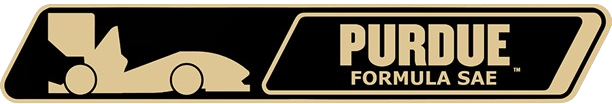

# Runsheet ReadMe

## Table of Contents
- [Introduction](#introduction)
- [Goals](#goals)
- [Directory] (#directory)
- [Usage](#usage)

## Introduction
Purdue Formula SAE - PF25

Authors: Anya Pokrovskaya & Michelle Qiu

## Goals
**1. Team:** Increase efficiency during testing and comp by creating a runsheet program that efficiently and effectively collects vehicle data across runs. To be used alongside Motec to supplement with additional data.

**2. Competition:** Increase performance during the design event by providing a full-stack software solution to support and enhance vehicle design.

* **Design (~%25):** Provide a way to orderly collect, store, and visualize testing data. 
  
* **Build (~%25):** Collects data that will hopefully validate various design choices made thorought the design season. 
  
* **Refinement/Validation (~%25):** Provides a platform for the team to develop and execute a year-long testing plan to validate and refine vehicle specs. Shows how the vehicle has evolved throughout the testing season, and changed to result in the final build.
  
* **Understanding (~%25):** Allows for thorough collection of testing data to understand relations between various vehicle components. Used for learning the ins-and-outs of the car for future competitions and new members.

## Directory

| File Name   | Use + Content                       |
| ----------- | ------------------------------------|
| app.py      | Main file to run the program        | 
| anya.py     | Anya's work in progress file        |
| michelle.py | Michelle's work in progress file    |
| old_code.py | Code from previous iteration (PF24) |
| assets      | Folder that holds images            |

## Usage
To run, start by cloning this repository into a local IDE that supports Python (ex. PyCharm, VSCode). From there, run the **app.py** file, and open the local host link. 
